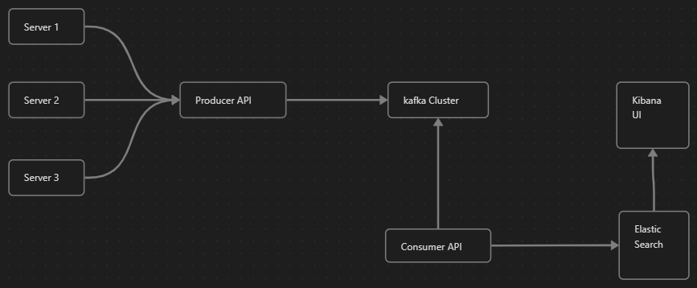

# Log Ingestor and Query Interface
## objective 

1. Develop a log ingestor system that can efficiently handle vast volumes of log data.
2. Need UI for querying this data using full-text search or specific field filters.
	- Full test Search
	- field for filter
		1. level
		2. Message
		3. Resource
		4. time stamp
		5. trace Id
		6. span Id
		7. commit
		8. matadata.parentResourse

## Functional Requirement

1. Agnostic of platform
2. Querying of Data

## Non Functional Requirement

1. **Scalability** to handle high volumes of logs
2. **Low latency**, need to ingest the data in _Near real-time_
3. **Volume** - able to ingest massive volumes

## Design Diagram



## Design choices I made

1. Kafka for handling high volume data. allows to use cluster mode and multiple node(Group_ID) which will eliminate the single point of failure. but in this project I'll be using single node for sake of simplicity.
2. Express based Rest API: because I know in typescript better the Go. I'll have two rest services, point of having two services will give me high scalability as both are independent services.  
	1. Producer-API : with the help of Load balancer we can scale data ingestor process. 
	2. Consumer-API: we can also scale this service for fast data dump into DB.
3. Elasticsearch for structured data handling and efficient search capabilities
4. Kibana is compatible with Elasticsearch

# How to setup the project
1. make sure you are in root of the folder
2. run  ```docker-compose up --build -d ``` This will up the multiple services
	1. Producer-API at ```http://localhost:3000```
	2. Kibna at ```https://localhost:5601```
3. once all the services is stared we seed the Kafka and Elasticsearch for that follow the following steps:
	1. ```cd admin && npm install```
	2. ```npm start```
4. yup, that's all you need to do. now you can ingest data i.e 
	``` 
	curl --location 'http://10.160.217.8:3000' \
	--header 'Content-Type: application/json' \
	--data '{
	    "level": "info",
	    "message": "Failed to connect to DB",
	    "resourceId": "server-1234",
	    "timestamp": "2023-09-15T08:00:00Z",
	    "traceId": "abc-xyz-123",
	    "spanId": "span-456",
	    "commit": "5e5342f",
	    "metadata": {
	        "parentResourceId": "server-0987"
	    }
	}'

	```

Before you check this things you must know 
1. code is not completely working at the last there was some version miss match of elastic due to which i was not able to dump the log to elastic. (failed to establish the connection from node to elastic)
2. kafka setup was fun. I was able to setup kafka, sending data to kafka and consuming data was successful.

